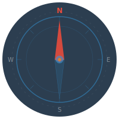

# We-Map

<p align="center">
  
</p>

街景猜谜桌面游戏 — 基于 Mapillary 街景和 OpenStreetMap，在全球 88 个城市中猜测你的位置。

## 功能

- **街景浏览** — 通过 Mapillary 在真实街景中探索
- **地图猜测** — 在 Leaflet 地图上点击标记你的猜测位置
- **距离评分** — 使用 Haversine 公式计算真实距离，指数衰减算法评分（满分 5000）
- **两种游戏模式**
  - 标准模式：完成固定轮数，争取最高总分
  - 生存模式：每轮需达到阈值分数才能继续
- **统计系统** — 追踪游戏历史、最佳分数、单轮最高分、平均距离等
- **题库管理** — 支持 JSON / CSV 格式导入，也可通过 Mapillary API 自动获取
- **明暗主题** — 支持明亮 / 暗黑模式切换，偏好自动持久化
- **系统托盘** — 最小化到托盘，支持置顶窗口、快速显示/隐藏
- **多语言** — 支持中文和英文

## 技术栈

| 层 | 技术 |
|---|------|
| 桌面框架 | Tauri 2.x |
| 前端 | Vue 3 + TypeScript + Vite |
| 状态管理 | Pinia |
| 路由 | Vue Router |
| 地图 | Leaflet |
| 街景 | Mapillary JS |
| 数据库 | SQLite (tauri-plugin-sql) |
| 国际化 | Vue I18n |
| 后端逻辑 | Rust (距离计算 / 评分) |

## 开发环境

### 前置要求

- [Node.js](https://nodejs.org/) >= 18
- [Rust](https://www.rust-lang.org/tools/install) >= 1.77
- [Tauri CLI 环境](https://v2.tauri.app/start/prerequisites/)

### 安装依赖

```bash
npm install
```

### 开发模式

```bash
npx tauri dev        # 同时启动前端和桌面应用
```

### 构建

```bash
cargo tauri build    # 构建安装包
```

## 题库准备

### 方式一：应用内自动获取

在设置页面中填入 Mapillary Client Token，点击"自动获取"即可从全球 88 个城市采样导入题目。

### 方式二：使用脚本抓取

```bash
node scripts/fetch-questions.js --token "MLY|你的Mapillary令牌" --count 500 --output questions.json
```

脚本从全球 88 个城市均匀采样，自动过滤距离过近的图片（最小间距 5km）。

### 方式三：手动导入

在应用的设置页面中，通过 JSON 或 CSV 格式导入题库数据。

**JSON 格式：**
```json
[
  { "imageId": "123456", "latitude": 35.6895, "longitude": 139.6917 },
  { "imageId": "789012", "latitude": 48.8566, "longitude": 2.3522 }
]
```

**CSV 格式：**
```csv
image_id,latitude,longitude
123456,35.6895,139.6917
789012,48.8566,2.3522
```

## Mapillary 令牌

需要在 [Mapillary Developer Portal](https://www.mapillary.com/developer) 注册并获取 Client Token，在应用设置中填入即可。

## 项目结构

```
we-map/
├── public/
│   └── vite.svg           # 应用图标（指南针）
├── scripts/               # 工具脚本
│   └── fetch-questions.js # 题库抓取
├── src/
│   ├── components/        # Vue 组件
│   ├── i18n/              # 国际化配置
│   ├── router/            # 路由配置
│   ├── services/          # 数据服务 (SQLite)
│   ├── stores/            # Pinia 状态管理
│   ├── types/             # TypeScript 类型定义
│   ├── utils/             # 工具函数
│   └── views/             # 页面视图
├── src-tauri/
│   ├── icons/             # 各平台应用图标（由 vite.svg 生成）
│   └── src/
│       ├── commands.rs    # Tauri 命令
│       ├── scoring.rs     # 距离计算与评分算法
│       └── lib.rs         # 应用入口 + 系统托盘
└── package.json
```

## 图标

应用图标为指南针设计，深色圆形底色上绘制方位指针，象征街景探索中的定位与导航。图标文件位于 `public/vite.svg`，桌面应用各尺寸图标由 `npx tauri icon public/vite.svg` 自动生成。

## 许可证

[Apache License 2.0](LICENSE)
